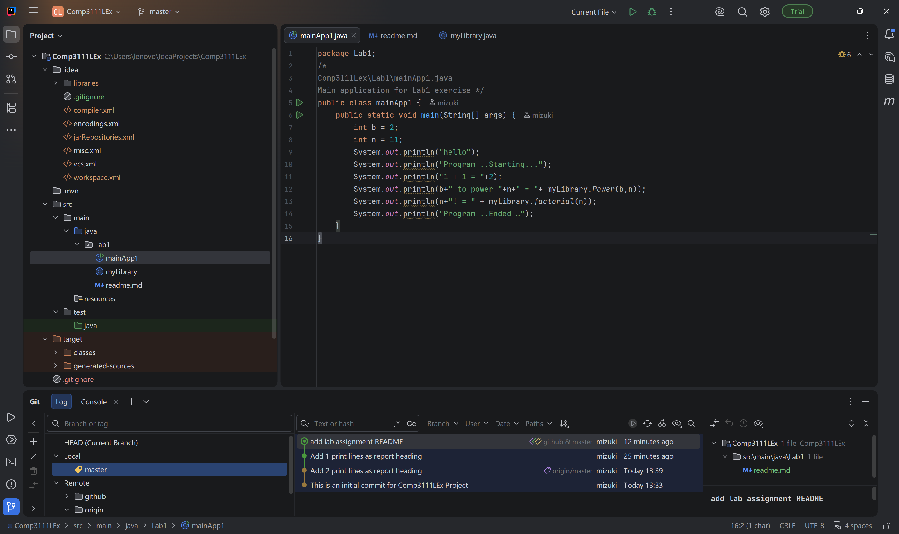

# COMP3111 Lab 1

This project introduces Java development with IntelliJ IDEA
and version control using Git and GitHub.

## Java Files

- myLibrary.java: provides power and factorial calculations.
- mainApp1.java: calls the library methods and prints the results.

## What I Learned

I learned how to create a Maven project, commit changes with Git,
and push my project to GitHub.!

## Screenshot

